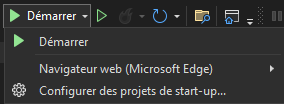
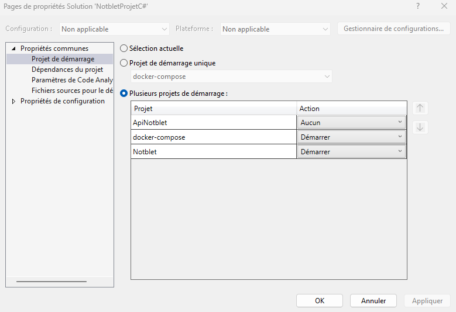
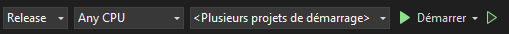

# Projet C# - Notblet
Par Alexandre Noblet

## Comment tester l'application ?

### Prérequis
- **Docker**
- **Windows**
- **Visual Studio**
- **Git**

### Etape 1 : Cloner le repository GitHub
**Cloner le repository** à l'endroit souhaité avec la commande :
```
git clone https://github.com/AlexNbl27/NotbletProjetCSharp.git
```

### Etape 2 : Ouvrir le projet dans Visual Studio
1) Ouvrir le logiciel **Visual Studio** (version recommandé : Visual Studio 2022)
2) Cliquer sur **Ouvrir un projet ou une solution**.
3) Rendez vous dans le **dossier cloné** depuis git. Ce-dernier s'appelle `NotbletProjetCSharp`.
4) Séléctionner le fichier : `NotbletProjetC#.sln`
5) Une fois dans Visual Studio, cliquez sur le bouton **Démarrer** puis sur **Configurer des projets de start-up** : <br>



6) Configurer les projets ``docker-compose`` et ``Notblet`` pour démarrer. Le dernier projet ``ApiNotblet`` ne doit pas démarrer donc être placé sur **Aucun**. Enfin cliquer sur **Appliquer**.



### Etape 3: Démarrer le projet
1. Vérifier que **Docker** est en cours d'éxécution sur votre machine
2. Démarrer le projet :



3. Une fois le projet **entièrement démarré** (attendre 30 secondes), **deux fenêtres** ont dû s'ouvrir sur votre machine. Une fenêtre de l'application WPF et une fenêtre donnant accès au swagger de l'API.

### Etape 4 : Tester l'application

1. Pour accéder à l'**application WPF**, vous pouvez utiliser les login :$
- **Login** : root
- **Password** : root

2. Pour accéder au **swagger**, vous pouvez utiliser l'adresse : https://localhost:9091/swagger/index.html. <br>
Attention ⚠️ Un très grand nombre de routes nécessitent d'avoir un **token d'authentification** obtenu suite à la route ``/login``. Je vous conseille d'utiliser l'application WPF pour tester toutes les fonctionnalités.

3. Quelques points à noter :
- Pour **modifier** un item : il faut double cliquer sur la ligne associée à l'item (product 1) ce qui va ouvrir une fenêtre pour modifier les informations actuelles.
- Pour **supprimer**, vous pouvez séléctionner plusieurs lignes et cliquer sur le bouton **Supprimer les *éléments* séléctionnés**.